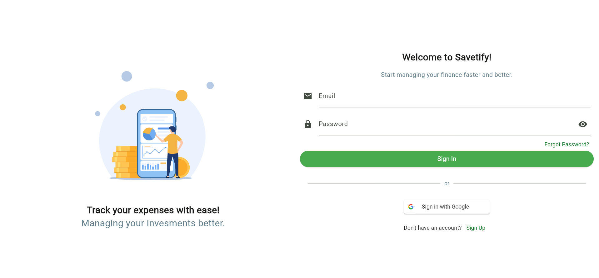
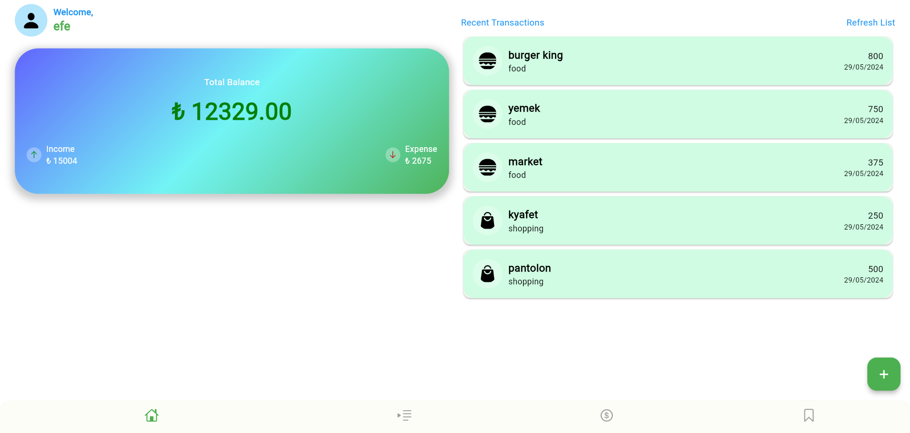
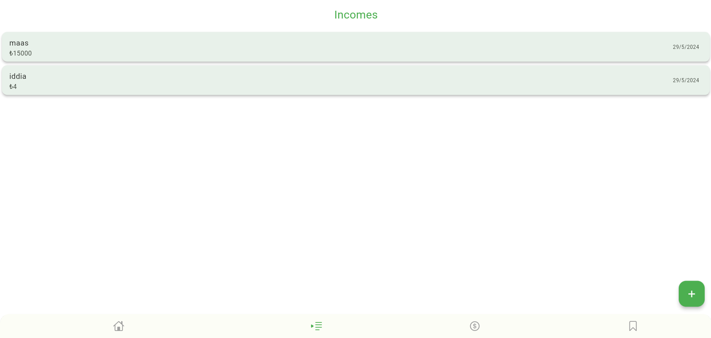
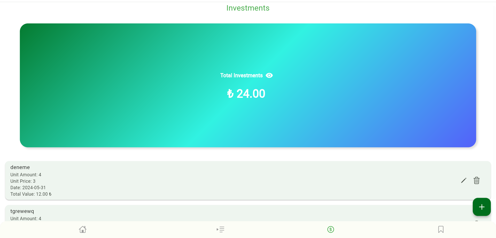
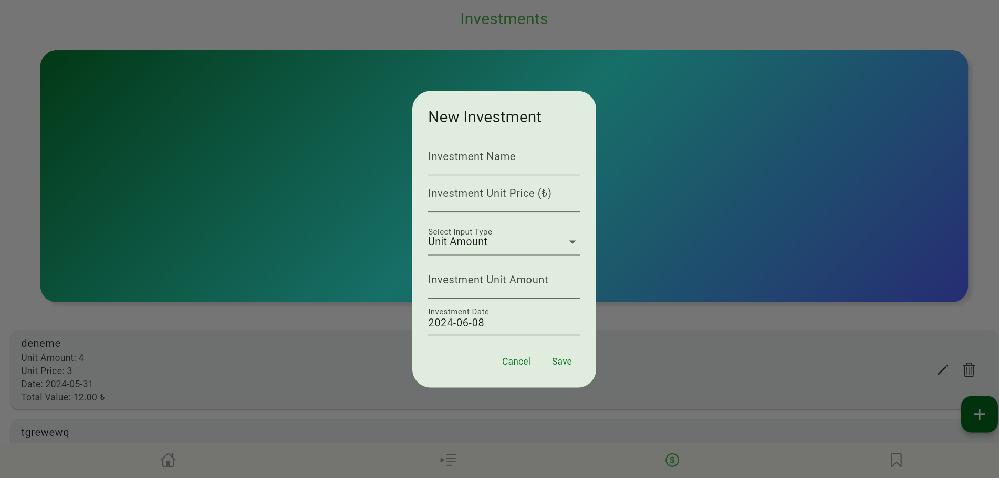
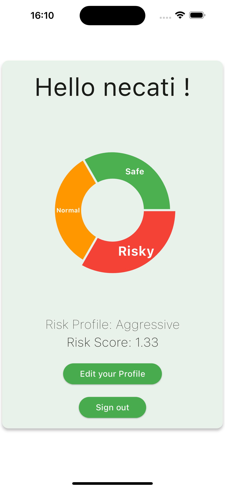
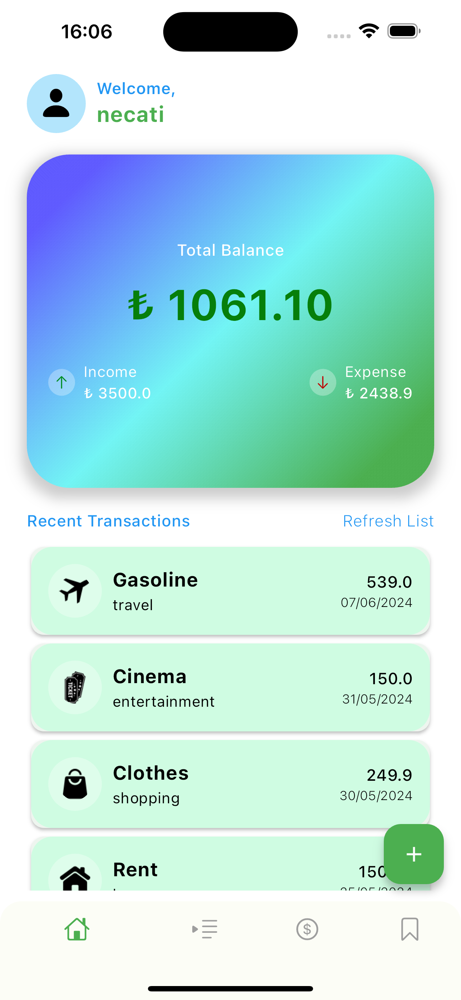
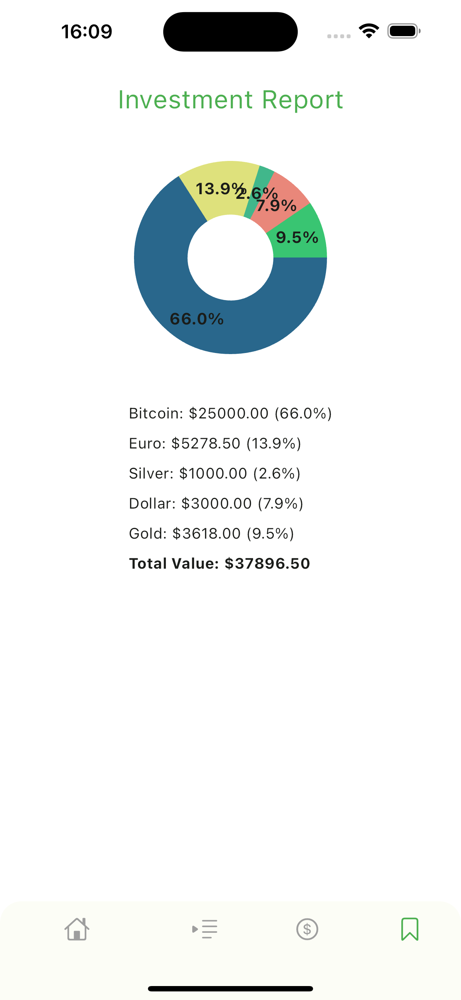

# Savetify

## Introduction
Savetify is a cross-platform mobile and web application designed to simplify personal finance management. It provides a secure environment for users to centralize and track their financial information, receive insights into their spending habits, and set achievable financial goals.

## Features
- Expense Tracking
- Income Tracking
- Investment Tracking
- Financial Summaries
- Detailed Reports
- Spending Insights
- Secure Account Management
- Data Visualization

## Technologies Used
-  Flutter
-  Firebase (Authentication, Firestore)
-  Git
- Design Patterns: MVVM, Repository, Modular programming
- Development Methodology: Waterfall

## Screenshots

## Contributors
- Mustafa Emir Uyar - 150120007
- Muhammed Hayta - 150121068
- Efe Özgen - 150121077
- Necati Koçak - 150120053

## License
This project is licensed under the MIT License. See the [LICENSE](LICENSE) file for details.
